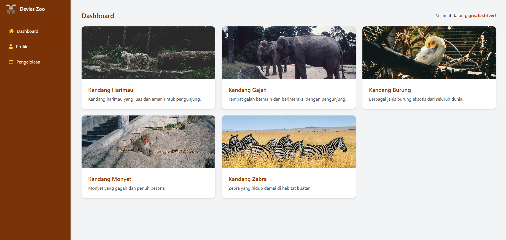

<p align="center"><a href="https://laravel.com" target="_blank"></a></p>

<p align="center">
<a href="https://github.com/laravel/framework/actions"></a>
<a href="https://packagist.org/packages/laravel/framework"></a>
<a href="https://packagist.org/packages/laravel/framework"></a>
<a href="https://packagist.org/packages/laravel/framework"></a>
</p>

## About This Project

This project is built using the Laravel framework as part of a web programming assignment. It demonstrates the use of Laravel's features such as routing, controllers, Blade templates, and more.

## Demo

Berikut adalah tampilan demo aplikasi:



Atau Anda dapat melihat video demo melalui link berikut:  
[Demo Video](https://www.youtube.com/watch?v=<YouTubeVideoID>)

---

## Installation

Ikuti langkah-langkah berikut untuk menjalankan proyek ini di komputer Anda:

### 1. Clone Repository
Clone repository ini ke komputer Anda menggunakan perintah berikut:

```bash
git clone https://github.com/username/repository-name.git
### 2. Masuk ke Direktori Proyek
Pindah ke direktori proyek yang telah di-clone:

```bash
cd repository-name

composer install

cp [.env.example](http://_vscodecontentref_/0) .env

php artisan key:generate

php artisan serve

npm run dev
